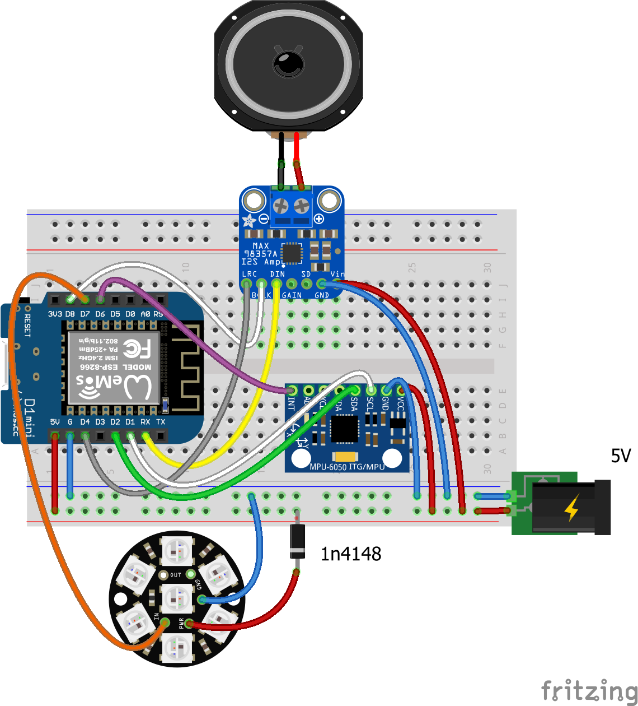

# ESParkle
MQTT driven visual &amp; audio notifier, based on ESP8266.

## Features

Audio notifications:
- Play MP3 or RTTTL, from SPIFFS or URL.
- Play AWS Polly TTS via a PHP companion script.

Visual notifications:
- Display blink, pulse, sine, rainbow,... effects using a NeoPixel module.
- When in standby mode, slowly cycle through colors.

Audio &amp; visual notifications can be mixed.

Audio notification are fugitive, limited by the duration of the sound (i.e. won't loop), while visual notifications are
persistent. This way, you can still be alerted of an event, even if you were not present during the audio notification.

And because not all events are equally important, you can affect them a different priority level: visual notifications
with higher priority will persist if a lower priority notification occurs (sound notifications will always be played,
whatever the priority level).

## Hardware
- ESP8266 - Wemos D1 module
- MPU-6050 - Accelerometer and gyro module 
- NeoPixel ring (I use a basic 3 LEDs model)
- MAX98357A - Adafruit I2S DAC module with 3W amplifier
- 2-3W speaker
- Eventually, 1n4148 diode*
- Enclosure of your choice

**The NeoPixel data line voltage in logic-high state has to be at least 0.7× the NeoPixel power voltage (see https://ben.artins.org/electronics/glitchy-neopixels/)*
 
### Wiring


### Enclosure
*A reclaimed deodorant stick makes a nifty enclosure... ;)*\


## Software
ESParkle was tested with the 2.4.0 version of the Arduino libraries for ESP8266.\
ESP8266 frequency must be set to 160MHz
- In Arduino IDE, select `Tools->CPU Frequency->160MHz`
- In PlatformIO, put `board_f_cpu = 160000000L` in your `platformio.ini` file

### External libraries
- https://github.com/earlephilhower/ESP8266Audio
- https://github.com/knolleary/pubsubclient
- https://github.com/bblanchon/ArduinoJson
- https://github.com/FastLED/FastLED
- https://github.com/jrowberg/i2cdevlib\
  https://github.com/jrowberg/i2cdevlib/tree/master/Arduino/MPU6050
  
*See README of each library for specific installation instructions.*

### Settings
- Rename `config.h.SAMPLE` into `config.h` and edit the settings to match your own configuration.
- Depending on your needs, you may have to slightly tweak external libraries code.\
  Here is a list of what I had to change:
  
  - Because JSON commands may grow fat (when mixing them, or sending RTTTL songs), you'd probably want to increase max
    MQTT packet size:\
    In `PubSubClient.h`, replace\
    `#define MQTT_MAX_PACKET_SIZE 128` with\
    `#define MQTT_MAX_PACKET_SIZE 512`.
  
  - Only if you plan to use RTTTL, and depending on your I2S DAC, you may have to decrease square wave signal amplitude
    to keep an acceptable volume, compared to MP3 files volume:\
    In `AudioGeneratorRTTTL.cpp`, replace\
    `int16_t val = (rem > ttlSamplesPerWaveFP10/2) ? 8192:-8192;` with\
    `int16_t val = (rem > ttlSamplesPerWaveFP10/2) ? 1024:-1024;` (feel free to try different values). 

## Interfaces

### MQTT commands

Notifications are triggered by simple JSON messages over MQTT.

*Examples*
````
- Play MP3 from URL, at reasonable volume, while displaying red pulses on NeoPixel:
  {"mp3":"http://www.dummyhost.net/esparkle/mp3/starwars.mp3","oncegain":0.4,"led":"Pulse","delay":5,"color":"0xff0000"}

- Play MP3 from SPIFFS, with a green slow sine visual effect:
  {"mp3":"/mp3/toad.mp3","led":"Sine","delay":20,"color":"0x00ff00"}

- Play RTTTL:
  {"rtttl":"starwars:d=4,o=5,b=180:8f,8f,8f,2a#.,2f.6,8d#6,8d6,8c6,2a#.6,f.6,8d#6,8d6,8c6,2a#.6,f.6,8d#6,8d6,8d#6,2c6"}

- Play TTS (via PHP companion script), with a fancy Disco visual effect and high priority:
  {"tts":"You look fantastic today","led":"Disco","priority":9}

- Blinks yellow, quite slowly, at low priority:
  {"led":"Blink","color":"0xffff00","delay":1500,"priority":1}

- Play random MP3 from online repository (via PHP companion script):
  {"mp3":"http://www.dummyhost.net/esparkle/esparkle_mp3.php?action=random"}

- Simple commands:
  {"cmd":"about"}   => display useful information about ESParkle
  {"cmd":"restart"} => restart ESP8266
  {"cmd":"break"}   => stop current notification
  {"cmd":"list"}    => list SPIFFS content
  {"gain":0.5}      => set default gain value
  {"oncegain":0.2}  => set once gain value (handy to adapt poorly encoded MP3 volume)
````
### Tap sensor
- 1 single tap stops current notification or, if no notification is running, plays predefined MP3 ("moo box" mode).
- 5 taps restart ESP


## Miscellaneous

### To do...
- Improve stability (ESParkle may crash/restart from time to time, when playing MP3 from URL). 
- Some code cleanup.

### Tips & tricks
- Define a MQTT retained message, with this simple command:
  ````
  {"mp3":"/mp3/bullfrog.mp3"}
  ````
  This way you'll get notified each time ESParkle will reconnect to the MQTTT server.
  
- I created ESParkle essentially to get notified of really important events I don't want to miss at work.
  Incidentally, I had great success with my colleagues when I decided that the 1 tap action would randomly pick a MP3
  file amongst my repository of famous movies dialogs. :)\
  For kids, animals sounds should have some success as well.

### Useful links
- Getting started with Cloud MQTT:\
  https://www.cloudmqtt.com/docs.html
- Getting started with AWS Polly TTS:\
  https://docs.aws.amazon.com/polly/latest/dg/getting-started.html
- RTTTL songs:\
  http://mines.lumpylumpy.com/Electronics/Computers/Software/Cpp/MFC/RingTones.RTTTL
- Free MP3 notification sounds:\
  https://notificationsounds.com
  
### Thanks
Embedded MP3 files are courtesy of https://notificationsounds.com . 

Many thanks to all the authors of above libraries, and more generally to all the generous people contributing to the
ESP8266 ecosystem.

And a special thank to  for making ESParkle possible, including the *essential* RTTTL player! ;)


### Disclaimer
Even if I try to improve myself, my C++ skills are very limited: I do programming like a Lego player, essentially by
assembling bricks made by real programmers.\
You've been warned...

For a real disclaimer, see the .
